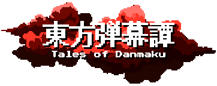

# Touhou ～ Tales of Danmaku

<p align="center">
    
</p>

<p align="center">
<a href=""><b>Play in Browser</b></a> •
<a href="https://github.com/Nyuke235/Touhou-Tales-of-Danmaku/blob/main/CONTRIBUTING.md"><b>Contribute</b></a>
</p>

---

**東方弾幕譚 (Tales of Danmaku)** is a Touhou fan-made danmaku game playable in the browser or as a native desktop app, built from scratch in TypeScript using the HTML5 Canvas.

Originally a uni project, the goal was to build a 2D shoot'em up playable in both solo and multiplayer. The player controls a character who must face waves of enemies and bosses while dodging bullets.

The game is inspired by **Embodiment of Scarlet Devil (EoSD)** and uses a **pixel art style**. All sprites were hand-crafted by Nyuke235, with some still serving as placeholders.

<p align="center">
    
</p>

## Notice

- As this is a learning project, you may encounter some "scaffolded" or messy code. Refactoring is an ongoing part of the roadmap.
- This project is built strictly for educational purposes and personal enjoyment.

## Characters

| Character       | Title                     | Speed  | Shot            | Spell Card                   |
| --------------- | ------------------------- | ------ | --------------- | ---------------------------- |
| Reimu Hakurei   | Shrine Maiden of Paradise | Medium | Exorcism Amulet | Divine Spirit "Fantasy Seal" |
| Marisa Kirisame | Ordinary Magician         | Fast   | Stardust        | Love Sign "Master Spark"     |

## Controls

Controls can be remapped in-game via the **Key Config** menu.

| Action       | Default key  |
| ------------ | ------------ |
| Move         | Arrow keys   |
| Shoot        | `Z`          |
| Bomb         | `X`          |
| Focus        | `Left Shift` |
| Menu select  | `Enter`      |
| Back / Pause | `Escape`     |

## Stages


|  **Stage**  |         **Title**          | **Mid-boss**  | **Mid-boss 2** |      **Boss**       | **Status** |
| :---------: | :------------------------: | :-----------: | :------------: | :-----------------: | :--------: |
|   Stage 1   | Black Ink Staining the Sky | Rumia (dark)  |       -        |        Rumia        |     ✅      |
|   Stage 2   | Ripples on the Misty Lake  |   Daiyousei   |       -        |        Cirno        |     🟨     |
|   Stage 3   | Beyond the Sightless Path  |     Rumia     |     Mystia     |    Hong Meiling     |     🔄     |
|   Stage 4   |            ???             |    Koakuma    |       -        | Patchouli Knowledge |     🚫     |
|   Stage 5   |            ???             |     Rika      |       -        |    Sakuya Izayoi    |     🚫     |
|   Stage 6   |            ???             | Sakuya Izayoi |       -        |   Remilia Scarlet   |     🚫     |
| Stage Extra |            ???             | Hong Meiling  | Sakuya Izayoi  |   Flandre Scarlet   |     🚫     |

✅ (Completed)
🟨 (Completed, but need rework)
🔄 (In progress)
🚫 (Not started)

## Running the game

### Browser (Docker Compose)

```bash
git clone https://github.com/Nyuke235/Touhou-Tales-of-Danmaku
cd Touhou-Tales-of-Danmaku

docker compose up --build
```

The game will be available at `http://localhost:8000`. The Express save server runs on port `9000`.

### Desktop app (Tauri)

```bash
docker build -f Dockerfile.tauri --output type=local,dest=./release .
```

The `.deb` and `.AppImage` artifacts will be written to `./release/`.

### Multiplayer

While the game is supposed to have a Multiplayer mode option, **online multiplayer is not currently in development**. It remains a planned feature for a later stage of the game.

## Credits

- Touhou Project and its characters are the property of Team Shanghai Alice (ZUN). This project follows the [Touhou Project Fan Content Guidelines](https://touhou-project.news/guidelines_en/).
- Music composed by [ZahranW](https://www.youtube.com/@ZahranW) and [TrojanHorse711](https://www.youtube.com/@Trojan711)
- Developed by Nyuke235

## License

This project is licensed under the **MIT License**.
